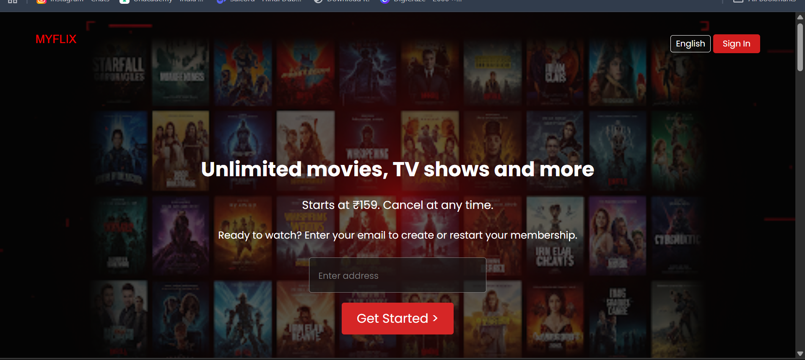

# 🎬 MyFlix - Landing Page (HTML & CSS)

This is a **Netflix-inspired landing page** built using only HTML and CSS.  
The project was created purely for **educational and portfolio purposes**, showcasing front-end development and web design skills.  

⚠️ **Disclaimer:**  
This project does not use or distribute any original Netflix assets, logos, or copyrighted content.  
All images, logos, and branding are **custom or royalty-free**.

---

## ✨ Features
- 🎨 Responsive design (desktop & mobile friendly)  
- 🏗️ Semantic HTML5 and modern CSS3  
- 🎥 Background video support (royalty-free video/demo only)  
- ❓ Accordion-style FAQ section  

---

## 🛠️ Tech Stack
- **HTML5:** Page structure  
- **CSS3:** Styling, layout & responsiveness  

---

## 🚀 Live Demo
👉 [View Live Project]()  

---

## 📸 Screenshot
  

---

## 📢 Notes
- The project is **inspired by Netflix UI** but uses **custom branding**.  
- Safe to showcase in portfolios, GitHub, or interviews.  
